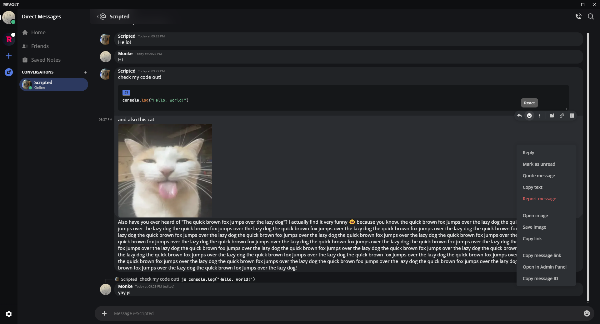
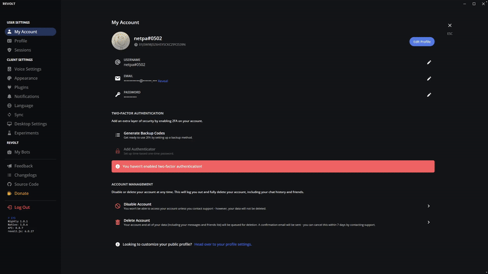
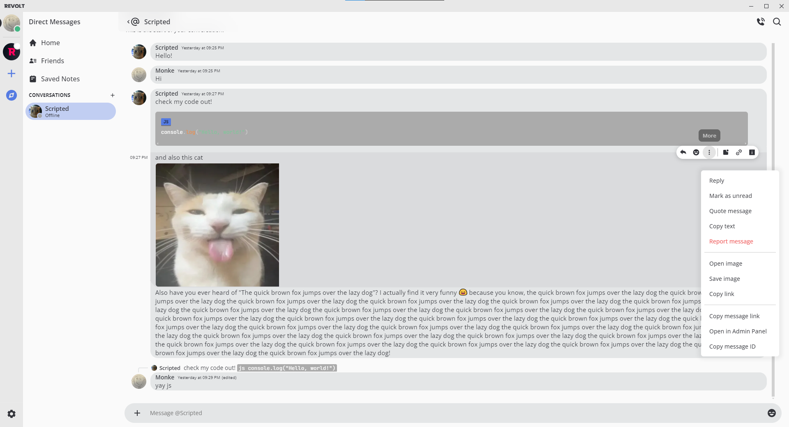
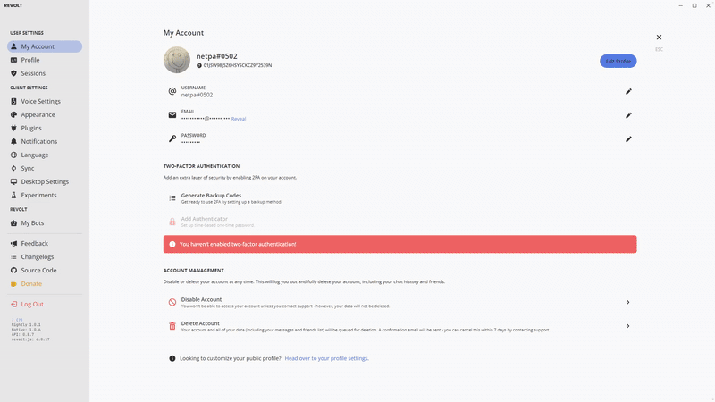

# Material for Revolt
A theme made for [Revolt](https://revolt.chat/) based on [CapnKitten's Material Discord](https://github.com/CapnKitten/Material-Discord) theme.

# Previews
<h3>

  
Material Dark

  <h5>
  • Chat
  
  • Settings
  

  
  

  </h5>

  
Material Light

  <h5>
  • Chat
  
  • Settings
  

  
  

  </h5>

</h3>
